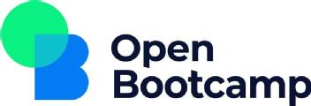

# OpenBootcamp 🌍

<h2>Descripción: 📄</h2>

Repositorio con todos mis códigos de los diferentes cursos que he hecho en la plataforma de OpenBootcamp. Se trata de un bootcamp gratuito personalizable, en el que puedes ir a tu ritmo y sin ningún tipo de compromiso. Puedes elegir cualquier tipo de ruta o hacer cursos que te interesen sin seguir ninguna ruta de aprendizaje que ellos te propongan. Además, te ayudan a la hora de encontrar trabajo cuando ya tienes un mínimo de conocimientos.

<h2>Contenidos: 🧑🏻‍🏫</h2>

  - *Conceptos de la programación:* Introducción a los conceptos relacionados con la programación. Necesarios para los que acaban de entrar en este mundo.
  
  - *Introducción a la programación:* En este módulo aprenderéis las bases de la programación desde cero para que, sea cual sea el lenguaje que queráis abordar, tengáis claros los conceptos.
  
  - *Python:* Lenguaje de programación interpretado que tiene como máxima destacar por una sintaxis que favorezca la legibilidad del código. Se trata de un lenguaje que soporta varios paradigmas tales como POO, programación imperativa y funcional.
  
  - *HTML y CSS:* Con este curso de HTML y CSS aprenderás las bases de todo desarrollo web, pues ambos son los lenguajes estándar para el desarrollo de páginas web en el mundo. Empieza a maquetar tus aplicaciones y páginas web de manera profesional desde 0.

<h2>Enlace al Bootcamp: :link:</h2>

  <a href="https://open-bootcamp.com/" target="blank">

